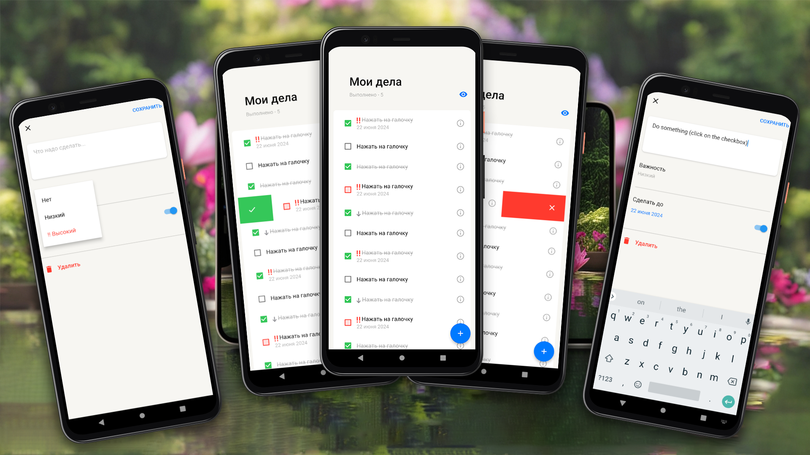
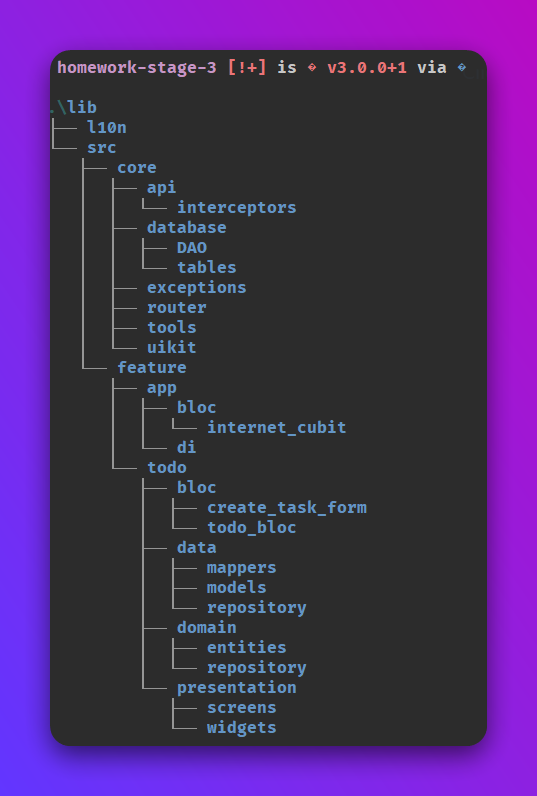

# Yet Another Todo 📋🚀

Welcome to "Yet Another Todo" app repo!
It's a Flutter app for making a todo list.

## Table of Contents 📝

1. [Features 🏁](#features-🏁)
2. [For devs 💾](#for-devs-💾)
3. [Screenshots 📷](#screenshots-📷)
4. [Architecture 📦](#architecture-📦)
5. [Download 🚀](#download-🚀)

## Features 🏁

The following criteria were met while doing the homework:

 - Layout for `view` and `add` screen
 - Logger for debug mode
 - App has its own icon and splash screen
 - App has dismissible swipe to delete and done
   but these are not implemented yet (layout only)
 - The code is written in a way that respects the
   design principles of separation into layers/features

I tried as hard as I could to maintain readability and code consistency (using autoformatter and linter), though it's still not perfect in my opinion, I could make better decomposition, but I'm happy with the result.

## For devs 💾

0. Install Flutter
1. Clone the repo to your local machine
2. Execute `flutter pub get`
3. Execute `flutter run` or start debugging in your IDE

## Screenshots 📷

Here you can see the layout that I was able to do:

  

## Architecture 📦

In this section I cover some of the core components of the app. 
So you can see how it's structured.

  

The app has 3 root directories in the project:

**core** - Handy function and helpers which I use across the app.

**feature** - The directory for all the app's modules and featuress.

  - app - The app entry point module for DI and some other stuff in the future.
  - todo - Main app feature for the todo list.

Each feature usually divided into 3 parts:

- presentation: UI
- domain: Entities and business logic
- data: Data sources and repositories

**uikit** - App's UI and Style components.

## Download 🚀

<!-- Look, Mom, I centered the div! 😁 -->

    <a href="https://github.com/Glitchy-Sheep/yet-another-todo/releases/latest">
        Click here to download the app
    </a>

